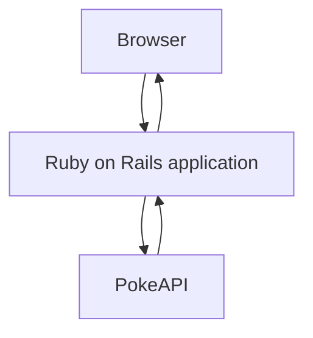
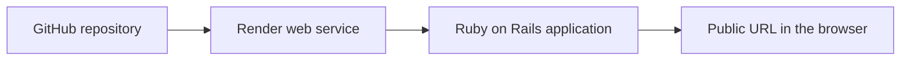

# Pokemon of the Day

Pokemon of the Day is a small Ruby on Rails app that features one Pokemon each day using the public [PokeAPI](https://pokeapi.co/). The featured Pokemon is selected with a deterministic date-based algorithm, so everyone sees the same Pokemon on the same day without needing a database or background jobs.

## Features

- Daily featured Pokemon
- Deterministic date-based selection
- Pokemon artwork, name, Pokedex number, types, height, weight, base experience, HP, Attack, and Defense
- Server-rendered HTML with ERB templates
- Simple, responsive design
- Render deployment configuration

## Technologies Used

- Ruby
- Ruby on Rails
- MVC architecture
- ERB templates
- HTTParty
- PokeAPI
- Render

## Architecture Overview

The request flow is intentionally small:



Deployment flow:



## How It Works

1. The browser requests the homepage.
2. `HomeController` handles the request.
3. The controller calls `PokemonOfTheDayService`.
4. The service uses today's UTC date to calculate a Pokemon ID.
5. The service fetches Pokemon data from PokeAPI.
6. Rails renders the ERB view with the returned data.

## Local Installation

1. Install Ruby 3.4.4 and Bundler.
2. Clone this repository.
3. Run `bundle install`.

## Running Locally

Start the app:

```bash
bundle exec rails server
```

Then open:

```text
http://localhost:3000
```

If you want to match Render's production behavior more closely, you can also run:

```bash
RAILS_ENV=production SECRET_KEY_BASE_DUMMY=1 bundle exec rails assets:precompile
bundle exec puma -C config/puma.rb
```

## Deployment Instructions

This project is configured for [Render](https://render.com/).

1. Push the repository to GitHub under the `TonyMarchello` account.
2. In Render, create a new Web Service.
3. Connect the GitHub repository.
4. Use the `render.yaml` blueprint or the manual settings below.
5. Set the branch to `main`.
6. Let Render build and deploy automatically on each push.

Manual settings if you prefer the dashboard:

- Runtime: Ruby
- Build command: `bash bin/render-build.sh`
- Start command: `bundle exec puma -C config/puma.rb`
- Environment variables:
  - `RAILS_ENV=production`
  - `RAILS_LOG_TO_STDOUT=true`
  - `RAILS_SERVE_STATIC_FILES=true`
  - `WEB_CONCURRENCY=1`

## Project Structure

- `app/controllers/home_controller.rb` controls the homepage request.
- `app/services/pokemon_of_the_day_service.rb` talks to PokeAPI and applies the daily selection algorithm.
- `app/views/home/index.html.erb` renders the homepage.
- `app/helpers/application_helper.rb` contains formatting helpers for the view.
- `config/routes.rb` defines the homepage route.
- `config/puma.rb` configures the web server for local development and Render.
- `render.yaml` defines the Render web service.
- `bin/render-build.sh` precompiles assets during deployment.

## Future Improvements

These ideas were intentionally left out to keep the project small and beginner-friendly:

- API response caching
- Background jobs
- Docker
- GitHub Actions CI
- Terraform deployment
- AWS deployment
- Logging enhancements
- Monitoring and alerting
- Rate limiting

## Why This Design

The app keeps Rails concepts visible:

- The controller handles HTTP requests.
- The service object handles external API logic.
- The view handles presentation.
- The route maps the browser to the controller action.

That separation makes the project easy to explain in an interview and easy to extend later.

